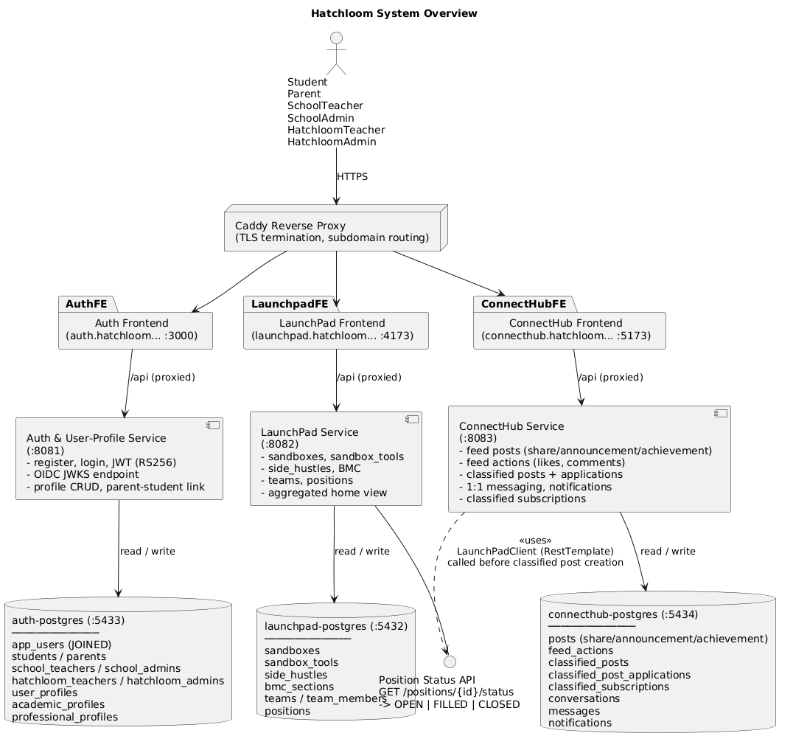

# HatchLoom Quebec

The HatchLoom Quebec subpack is an education platform monorepo composed of three microservices and their frontends, orchestrated together via Docker Compose.

---

## Table of Contents

1. [System Architecture](#system-architecture)
2. [Services](#services)
3. [Cross-Service Communication](#cross-service-communication)
4. [Installation](#installation)
5. [Configuration](#configuration)
6. [Running the Full Stack](#running-the-full-stack)
7. [Running Services Individually](#running-services-individually)
8. [Test Documentation](#test-documentation)
9. [API Documentation](#api-documentation)
10. [Deployment (Google Cloud VM)](#deployment-google-cloud-vm)
11. [CI/CD (GitHub Actions)](#cicd-github-actions)

---

## System Architecture

The subpack is composed of three independently deployable microservices, each with its own frontend SPA, backend Spring Boot API, and PostgreSQL database. There is no API gateway. Each frontend proxies its own `/api/*` traffic to its backend, and JWT authentication is enforced independently by every backend.



> Source: [diagrams/component_overview.puml](diagrams/component_overview.puml)

### Components

| Component               | Technology                    | Function                                                                                                           |
| ----------------------- | ----------------------------- | ------------------------------------------------------------------------------------------------------------------ |
| **auth-frontend**       | React + Vite, served by nginx | Login, registration, profile management UI                                                                         |
| **auth-service**        | Spring Boot 4, Java 25        | Issues JWT access/refresh tokens (RS256), exposes OIDC discovery + JWKS endpoints, manages user profiles and roles |
| **auth-postgres**       | PostgreSQL 16                 | Stores user accounts, roles, and profiles                                                                          |
| **launchpad-frontend**  | React + Vite, served by nginx | Student workspace UI: sandboxes, side hustles, BMC editor, team management                                         |
| **launchpad-service**   | Spring Boot 4, Java 25        | Sandboxes, SideHustles, Business Model Canvases, Teams, Positions; validates JWTs via auth-service JWKS            |
| **launchpad-postgres**  | PostgreSQL 16                 | Stores sandboxes, side_hustles, bmc_sections, teams, positions                                                     |
| **connecthub-frontend** | React + Vite, served by nginx | Social feed UI: posts, classified listings, messaging                                                              |
| **connecthub-service**  | Spring Boot 4, Java 25        | Feed posts, feed actions, classified posts, messaging, notifications; validates JWTs via auth-service JWKS         |
| **connecthub-postgres** | PostgreSQL 16                 | Stores posts, feed_actions, classified_posts, conversations, messages, notifications                               |
| **auth-pgadmin**        | pgAdmin 4                     | Web-based database management (dev/ops use)                                                                        |

### User Roles

The system supports six roles, enforced via RBAC in auth-service:

`STUDENT` · `PARENT` · `SCHOOL_TEACHER` · `SCHOOL_ADMIN` · `HATCHLOOM_TEACHER` · `HATCHLOOM_ADMIN`

---

## Services

| Service                         | Description                                                              | API Port | Frontend Port |
| ------------------------------- | ------------------------------------------------------------------------ | -------- | ------------- |
| [user-service](./user-service/) | Authentication and user profile management                               | 8081     | 3000          |
| [launchpad](./launchpad/)       | Student entrepreneurship workspace (Sandboxes, SideHustles, BMCs, Teams) | 8082     | 4173          |
| [connecthub](./connecthub/)     | Social feed, posts, classified listings, and messaging                   | 8083     | 5173          |

A pgAdmin instance is also available at **http://localhost:5050** for database management.

---

## Cross-Service Communication

Services communicate over the internal Docker network. There are two integration points:

### 1. JWT Validation (auth-service -> launchpad-service, connecthub-service)

auth-service issues RS256 JWT access tokens and exposes a standard OIDC discovery endpoint. Both launchpad-service and connecthub-service validate incoming Bearer tokens by fetching the public key from auth-service's JWKS endpoint - they do not share a secret and do not talk to auth-service at request time.

```
Browser
  │  Authorization: Bearer <JWT>
  ▼
launchpad-service / connecthub-service
  │  GET /.well-known/jwks.json  (once, cached)
  ▼
auth-service (:8081)
  │  { "keys": [ RSA public key (RS256) ] }
  ◄──────────────────────────────────────
```

**Endpoints provided by auth-service:**

| Endpoint                                | Description                             |
| --------------------------------------- | --------------------------------------- |
| `GET /.well-known/openid-configuration` | OIDC discovery document                 |
| `GET /.well-known/jwks.json`            | RSA public key set for JWT verification |

### 2. Position Status Interface (launchpad-service -> connecthub-service)

When a user creates a classified post in ConnectHub, the service validates that the referenced LaunchPad position exists and is `OPEN` by calling a public endpoint on launchpad-service. This call requires no authentication token.

```
connecthub-service
  │  GET /positions/{positionId}/status
  ▼
launchpad-service (:8082)
  │  "OPEN" | "FILLED" | "CLOSED"
  ◄──────────────────────────────
```

This is the only synchronous service-to-service call in the system. ConnectHub uses a `LaunchPadClient` (RestTemplate) configured with `LAUNCHPAD_SERVICE_URL` from the environment.

**Position status values:**

| Status   | Meaning                        |
| -------- | ------------------------------ |
| `OPEN`   | Accepting applicants           |
| `FILLED` | Position has been filled       |
| `CLOSED` | Manually closed by the student |

### Request flow summary

```
User Browser
  │
  │ HTTPS
  ▼
Caddy (reverse proxy, TLS termination)
  │
  ├─► auth-frontend (:3000)
  │       │  /api/* -> auth-service (:8081)
  │       │              └─► auth-postgres (:5433)
  │
  ├─► launchpad-frontend (:4173)
  │       │  /api/* -> launchpad-service (:8082)
  │       │              ├─► launchpad-postgres (:5432)
  │       │              └─► auth-service JWKS (token validation, cached)
  │
  └─► connecthub-frontend (:5173)
          │  /api/* -> connecthub-service (:8083)
          │              ├─► connecthub-postgres (:5434)
          │              ├─► auth-service JWKS (token validation, cached)
          │              └─► launchpad-service position status (on classified post creation)
```

---

## Installation

### Prerequisites

Ensure the following are installed before proceeding:

| Tool           | Minimum version | Notes                                                                        |
| -------------- | --------------- | ---------------------------------------------------------------------------- |
| Docker         | 24+             | Required for all container-based runs                                        |
| Docker Compose | v2 (plugin)     | Included with Docker Desktop; `docker compose version` to verify             |
| Java (JDK)     | 25              | Only required to run backends natively without Docker                        |
| Maven          | 3.9+            | Only required to run backends natively; or use the included `./mvnw` wrapper |
| Node.js        | 22+             | Only required to run frontends natively without Docker                       |
| Git            | any             | To clone the repository                                                      |

**Verify Docker Compose plugin:**

```bash
docker compose version
# Docker Compose version v2.x.x
```

### Clone the repository

```bash
git clone https://github.com/anthonytoyco/hatchloom-backend.git
cd hatchloom-backend
```

---

## Configuration

All services are configured through a single `.env` file at the repository root. Docker Compose reads this file automatically.

```bash
cp .env.example .env
```

Open `.env` and set values appropriate for your environment. The table below lists every variable:

| Variable                          | Default (`.env.example`)        | Description                                                                      |
| --------------------------------- | ------------------------------- | -------------------------------------------------------------------------------- |
| `LAUNCHPAD_DB`                    | `launchpad_db`                  | Launchpad PostgreSQL database name                                               |
| `LAUNCHPAD_USER`                  | `launchpad_user`                | Launchpad PostgreSQL username                                                    |
| `LAUNCHPAD_PASSWORD`              | `changeme`                      | Launchpad PostgreSQL password                                                    |
| `AUTH_DB`                         | `user_service_db`               | Auth PostgreSQL database name                                                    |
| `AUTH_USER`                       | `auth_user`                     | Auth PostgreSQL username                                                         |
| `AUTH_PASSWORD`                   | `changeme`                      | Auth PostgreSQL password                                                         |
| `CONNECTHUB_DB`                   | `connecthub_db`                 | ConnectHub PostgreSQL database name                                              |
| `CONNECTHUB_USER`                 | `connecthub_user`               | ConnectHub PostgreSQL username                                                   |
| `CONNECTHUB_PASSWORD`             | `changeme`                      | ConnectHub PostgreSQL password                                                   |
| `JWT_ACCESS_TOKEN_EXPIRY_MINUTES` | `30`                            | Access token lifetime in minutes                                                 |
| `JWT_REFRESH_TOKEN_EXPIRY_DAYS`   | `7`                             | Refresh token lifetime in days                                                   |
| `JWT_ISSUER_URI`                  | `http://auth-service:8080`      | JWT issuer URI (internal Docker network address)                                 |
| `AUTH_SERVICE_URL`                | `http://auth-service:8080`      | Internal URL for auth-service (used by launchpad and connecthub for JWKS)        |
| `LAUNCHPAD_SERVICE_URL`           | `http://launchpad-service:8080` | Internal URL for launchpad-service (used by connecthub's LaunchPadClient)        |
| `PGADMIN_DEFAULT_EMAIL`           | `admin@example.com`             | pgAdmin login email                                                              |
| `PGADMIN_DEFAULT_PASSWORD`        | `changeme`                      | pgAdmin login password                                                           |
| `VITE_API_BASE_URL`               | `/api`                          | API base path baked into frontend builds (keep as `/api` when using nginx proxy) |
| `VITE_AUTH_URL`                   | `http://localhost:3000`         | Public URL of auth-frontend (used for login redirects from other frontends)      |
| `VITE_CONNECTHUB_URL`             | `http://localhost:5173`         | Public URL of connecthub-frontend                                                |
| `VITE_CONNECTHUB_API_URL`         | `http://localhost:8083`         | Public URL of ConnectHub API (used by LaunchPad to link classified post details) |
| `CORS_ALLOWED_ORIGINS`            | `http://localhost:3000,...`     | Comma-separated list of origins allowed by Spring Boot CORS configuration        |

> **Important:** `VITE_*` variables are baked into the frontend static assets at Docker **build** time. If you change them, you must rebuild the frontend images (`docker compose up --build`).

---

## Running the Full Stack

Build and start all ten containers from the repository root:

```bash
docker compose up --build
```

To run in the background:

```bash
docker compose up -d --build
```

Wait for all containers to become healthy (auth-service takes up to ~30 seconds on first start while Spring generates the RSA key pair):

```bash
docker compose ps
```

To stop and remove all containers:

```bash
docker compose down
```

To also remove persistent database volumes:

```bash
docker compose down -v
```

### Local service URLs

| URL                   | Service               |
| --------------------- | --------------------- |
| http://localhost:3000 | User Service Frontend |
| http://localhost:4173 | LaunchPad Frontend    |
| http://localhost:5173 | ConnectHub Frontend   |
| http://localhost:8081 | User Service API      |
| http://localhost:8082 | LaunchPad API         |
| http://localhost:8083 | ConnectHub API        |
| http://localhost:5050 | pgAdmin               |

### Startup order

Docker Compose enforces the following startup dependency chain:

```
auth-postgres (healthy)
    └─► auth-service (healthy - OIDC endpoint reachable)
            ├─► launchpad-postgres (healthy)
            │       └─► launchpad-service
            │               └─► launchpad-frontend
            └─── connecthub-postgres (healthy)
                     └─► connecthub-service
                             └─► connecthub-frontend
```

---

## Running Services Individually

Each service can be run independently. See the service-level README for details:

- [user-service/README.md](./user-service/README.md)
- [launchpad/README.md](./launchpad/README.md)
- [connecthub/README.md](./connecthub/README.md)

### Running a backend natively (example: launchpad)

```bash
# Start only the database
cd launchpad
docker compose -f docker-compose.yaml -f docker-compose.dev.yaml up -d launchpad-postgres

# Run the backend (dev profile skips external auth requirement)
cd backend
./mvnw spring-boot:run
```

The dev profile (`docker-compose.dev.yaml`) sets `SPRING_PROFILES_ACTIVE=dev`, which bypasses the external JWT validation requirement so the auth-service does not need to be running locally.

### Running tests

See [Test Documentation](#test-documentation) for the full inventory of unit, integration, and system tests by module and location.

---

## Test Documentation

This repository uses three test types:

- **Unit tests**: fast tests run during `mvn test` (includes unit, slice/controller, and app context checks).
- **Integration tests**: database/API-crossing tests run during `mvn verify`.
- **System tests**: cross-service end-to-end tests in the dedicated `system-tests` module.

### How the test pipeline works

The backend modules (`user-service`, `launchpad/backend`, `connecthub/backend`) use Maven's standard split:

- `maven-surefire-plugin` runs the **unit phase** via `mvn test`.
- `maven-failsafe-plugin` runs the **integration phase** during `mvn verify`.

Current separation rules:

- Unit phase excludes `*IntegrationTest`, `*ApiIntegrationTest`, and `*RepositoryTest` patterns.
- ConnectHub and user-service additionally exclude JUnit `@Tag("integration")` from unit phase.
- Integration phase includes `*IntegrationTest`, `*ApiIntegrationTest`, and `*RepositoryTest` patterns.

System tests are isolated in the standalone `system-tests` Maven module and are executed with `mvn test` from that directory.

### Common Commands

```bash
# Unit phase
cd user-service && ./mvnw test
cd launchpad/backend && ./mvnw test
cd connecthub/backend && ./mvnw test

# Integration phase
cd user-service && ./mvnw verify
cd launchpad/backend && ./mvnw verify
cd connecthub/backend && ./mvnw verify

# System phase (uses docker-compose.test.yaml)
cd system-tests && mvn test
```

### Implementations of Each Test Type

#### Unit Tests

Implementation characteristics:

- Pure logic tests use JUnit 5 + Mockito style patterns.
- Controller slice tests use Spring MVC test support (`MockMvc`), typically with `*WebMvcTest` naming.
- Service unit tests in ConnectHub use explicit `*ServiceUnitTest` naming.
- Application context sanity checks use `*ApplicationTests` classes.

Runtime behavior:

- Should be fast and deterministic.
- Should not depend on Docker Compose or cross-service availability.
- Focuses on validation, controller contracts, service logic, and security behavior at unit/slice level.

#### Integration Tests

Implementation characteristics:

- Run against real Spring Boot wiring and persistence layers.
- Include API-level tests (`*ApiIntegrationTest`) and repository tests (`*RepositoryTest`).
- ConnectHub integration suites are named `*IntegrationTest` and tagged with `@Tag("integration")`.

Runtime behavior:

- Exercise database interactions, transaction boundaries, serialization, and API behavior beyond simple mocking.
- Executed in Maven `verify` lifecycle (Failsafe), separate from unit test phase.

#### System Tests

Implementation characteristics:

- Located in `system-tests/src/test/java` and share `BaseSystemTest`.
- Use Java `HttpClient` + Jackson to call live APIs over HTTP.
- Automatically bootstrap backend dependencies via `docker compose -f docker-compose.test.yaml up -d --build`.

How `BaseSystemTest` works:

- Resolves `docker-compose.test.yaml` relative to compiled test location.
- Performs startup/readiness checks with explicit bounded timeouts.
- Waits for:
  - auth-service OIDC discovery endpoint (`/.well-known/openid-configuration`) returning `200`.
  - connecthub-service feed endpoint (`/api/feed`) returning non-5xx.
  - launchpad-service TCP reachability.
- Authenticates fixture users before tests run and reuses tokens in test requests.
- Emits compose diagnostics (`docker compose ps` and `docker compose logs`) when startup fails.

What system tests verify:

- Feed post creation/retrieval/deletion flows.
- Feed actions (likes/comments) behavior.
- Messaging conversation and message flows.
- Cross-service behavior for ConnectHub dependencies:
  - LaunchPad position status lookup (`/positions/{positionId}/status`).
  - Auth service token/JWKS-driven security path readiness via OIDC discovery.
  - Classified post creation allowed only while linked LaunchPad position is `OPEN`.

### Test Inventory by Location and Type

#### connecthub/backend/src/test/java

| Type        | Tests                                                                                                                                                                                                                                |
| ----------- | ------------------------------------------------------------------------------------------------------------------------------------------------------------------------------------------------------------------------------------ |
| Unit        | `ConnecthubServiceApplicationTests`, `FeedPostControllerWebMvcTest`, `MessageControllerWebMvcTest`, `ClassifiedPostServiceUnitTest`, `FeedActionServiceUnitTest`, `FeedPostServiceUnitTest`, `JwtUtilTest`, `MessageServiceUnitTest` |
| Integration | `ClassifiedPostIntegrationTest`, `FeedActionIntegrationTest`, `FeedPostIntegrationTest`, `MessageIntegrationTest`, `NotificationIntegrationTest`, `ClassifiedPostRepositoryTest`, `FeedPostRepositoryTest`, `MessageRepositoryTest`  |
| System      | None in this module                                                                                                                                                                                                                  |

Notes:

- Unit tests here cover controller slices and isolated service logic.
- Integration tests validate feed, classified, messaging, and notification flows using full Spring wiring and persistence.

#### launchpad/backend/src/test/java

| Type        | Tests                                                                                                                                                                                                                                                                                                                                                                                                                     |
| ----------- | ------------------------------------------------------------------------------------------------------------------------------------------------------------------------------------------------------------------------------------------------------------------------------------------------------------------------------------------------------------------------------------------------------------------------- |
| Unit        | `LaunchpadApplicationTests`, `BMCControllerTest`, `BMCControllerWebMvcTest`, `LaunchPadHomeControllerTest`, `PositionControllerTest`, `PositionControllerWebMvcTest`, `SandboxControllerTest`, `SandboxToolControllerTest`, `SideHustleControllerTest`, `TeamControllerTest`, `BMCServiceTest`, `LaunchPadAggregatorTest`, `PositionServiceTest`, `SandboxServiceTest`, `SandboxToolServiceTest`, `SideHustleServiceTest` |
| Integration | `BMCApiIntegrationTest`, `PositionApiIntegrationTest`, `BMCRepositoryTest`, `PositionRepositoryTest`                                                                                                                                                                                                                                                                                                                      |
| System      | None in this module                                                                                                                                                                                                                                                                                                                                                                                                       |

Notes:

- Unit tests heavily exercise controller/service contracts for sandbox, side hustle, BMC, team, and position domains.
- Integration tests focus on API behavior and repository persistence for BMC and position modules.
- `LaunchpadApplicationTests` is tagged `integration`; with the current naming-based Failsafe includes, it is mainly a context sanity class for explicit runs rather than a primary CI gate test.

#### user-service/src/test/java

| Type        | Tests                                                                                                                                                                    |
| ----------- | ------------------------------------------------------------------------------------------------------------------------------------------------------------------------ |
| Unit        | `UserServiceApplicationTests`, `AuthControllerWebMvcTest`, `OidcControllerWebMvcTest`, `SessionManagerTest`, `AuthServiceTest`, `ProfileServiceTest`, `RoleStrategyTest` |
| Integration | `AuthApiIntegrationTest`, `ProfileApiIntegrationTest`, `UserRepositoryTest`                                                                                              |
| System      | None in this module                                                                                                                                                      |

Notes:

- Unit tests cover authentication/session logic, RBAC strategies, profile business rules, and auth controller slice behavior.
- Integration tests validate auth/profile endpoints and repository persistence against real Spring/JPA wiring.

#### system-tests/src/test/java

| Type        | Tests                                                                                                 |
| ----------- | ----------------------------------------------------------------------------------------------------- |
| Unit        | None in this module                                                                                   |
| Integration | None in this module                                                                                   |
| System      | `FeedActionsSystemTest`, `FeedPostSystemTest`, `MessageSystemTest`, `CrossServiceContractsSystemTest` |

System test support base class: `BaseSystemTest`.

Notes:

- These tests run against the backend stack defined in `docker-compose.test.yaml` (no frontend containers).
- They validate real HTTP contracts across service boundaries rather than mocked collaborators.

---

## API Documentation

Interactive Swagger UI docs are available when any service is running:

| Service      | Swagger UI                            | OpenAPI JSON                      |
| ------------ | ------------------------------------- | --------------------------------- |
| User Service | http://localhost:8081/swagger-ui.html | http://localhost:8081/v3/api-docs |
| LaunchPad    | http://localhost:8082/swagger-ui.html | http://localhost:8082/v3/api-docs |
| ConnectHub   | http://localhost:8083/swagger-ui.html | http://localhost:8083/v3/api-docs |

Static API reference:

- [User Service API](./user-service/API_DOCUMENTATION.md)
- [LaunchPad API](./launchpad/API_DOCUMENTATION.md)
- [ConnectHub API](./connecthub/API_DOCUMENTATION.md)

---

## Deployment (Google Cloud VM)

The production stack runs on a **Google Cloud e2-standard-2 VM** (2 vCPUs, 8 GB RAM, Debian 12, `us-central1-a`). All ten containers from the root `docker-compose.yaml` run on the VM, with [Caddy](https://caddyserver.com/) acting as the reverse proxy handling HTTPS termination via Let's Encrypt.

### Architecture

```
Internet
    │
    ▼
Caddy (ports 80 / 443) - auto HTTPS via Let's Encrypt
    │
    ├─► auth.hatchloom.anthonytoyco.com      -> auth-frontend     (localhost:3000)
    ├─► launchpad.hatchloom.anthonytoyco.com -> launchpad-frontend (localhost:4173)
    └─► connecthub.hatchloom.anthonytoyco.com -> connecthub-frontend (localhost:5173)
```

Caddy routes each subdomain to the matching frontend container. The frontend nginx configs then proxy `/api/*` traffic to their Spring Boot backend on the internal Docker network. Backend services and databases are not publicly exposed.

### Container Port Map

| Container             | Internal Port | Host Port | Public via Caddy |
| --------------------- | ------------- | --------- | ---------------- |
| `auth-frontend`       | 80            | 3000      | Yes              |
| `launchpad-frontend`  | 80            | 4173      | Yes              |
| `connecthub-frontend` | 80            | 5173      | Yes              |
| `auth-service`        | 8080          | 8081      | No               |
| `launchpad-service`   | 8080          | 8082      | No               |
| `connecthub-service`  | 8080          | 8083      | No               |
| `launchpad-postgres`  | 5432          | 5432      | No               |
| `auth-postgres`       | 5432          | 5433      | No               |
| `connecthub-postgres` | 5432          | 5434      | No               |
| `auth-pgadmin`        | 80            | 5050      | No               |

### Production URLs

| URL                                           | Service               |
| --------------------------------------------- | --------------------- |
| https://auth.hatchloom.anthonytoyco.com       | User Service Frontend |
| https://launchpad.hatchloom.anthonytoyco.com  | LaunchPad Frontend    |
| https://connecthub.hatchloom.anthonytoyco.com | ConnectHub Frontend   |

### Deployment steps

See [claude/0-deployment-guide-start-here.md](./claude/0-deployment-guide-start-here.md) for the full step-by-step guide, which covers VM provisioning, Docker setup, Caddy configuration, SSL, and GitHub Actions secrets.

---

## CI/CD (GitHub Actions)

CI is split between service build/test workflows and orchestration workflows:

- **6 service workflows** run on `push` and `pull_request` to `main` (3 backend + 3 frontend).
- **1 system test workflow** (`system-tests.yml`) runs on `workflow_run` after backend workflows complete successfully on `main` pushes.
- **1 deploy workflow** (`deploy.yml`) runs on `workflow_run` and deploys only after all required workflows for the same commit SHA are green.

Docker images are pushed to **GitHub Container Registry (GHCR)** at `ghcr.io/anthonytoyco/<image-name>` on `main` pushes.

### CI Workflows

| Workflow file               | Trigger                  | What it does                                                                                                                                                              |
| --------------------------- | ------------------------ | ------------------------------------------------------------------------------------------------------------------------------------------------------------------------- |
| `user-service-backend.yml`  | push / PR -> main        | Calls reusable Java CI; runs unit phase (`test`) + Postgres-backed integration phase (`failsafe`), uploads reports, builds/pushes image on main push                      |
| `connecthub-backend.yml`    | push / PR -> main        | Calls reusable Java CI; runs unit phase (`test`) + Postgres-backed integration phase (`failsafe`), uploads reports, builds/pushes image on main push                      |
| `launchpad-backend.yml`     | push / PR -> main        | Calls reusable Java CI with issuer override; runs unit phase (`test`) + Postgres-backed integration phase (`failsafe`), uploads reports, builds/pushes image on main push |
| `user-service-frontend.yml` | push / PR -> main        | Calls reusable Node CI: `npm ci`, lint, build, uploads `dist`, builds/pushes image on main push                                                                           |
| `launchpad-frontend.yml`    | push / PR -> main        | Calls reusable Node CI with typecheck enabled, then build + image publish on main push                                                                                    |
| `connecthub-frontend.yml`   | push / PR -> main        | Calls reusable Node CI: lint + build + image publish on main push                                                                                                         |
| `system-tests.yml`          | workflow_run (main push) | Runs cross-service system tests after backend workflow success (`mvn test` in `system-tests`)                                                                             |

Reusable workflow templates:

- **`_reusable-java-ci.yml`**: Java 25 setup with explicit two-phase backend testing:
  - `unit-tests`: runs `./mvnw clean test` and uploads Surefire reports.
  - `integration-tests`: provisions PostgreSQL 16 service container, runs `./mvnw failsafe:integration-test failsafe:verify`, and uploads Failsafe reports.
  - `build-docker`: runs only on `main` pushes after required test jobs succeed.
- **`_reusable-node-ci.yml`**: Node 22 setup, `npm ci`, lint, optional typecheck, `npm run build`, `dist` artifact upload, Docker build/push on main pushes.

### Backend CI Modes

All three backend workflows call the same reusable Java workflow and use the same CI path.

- Unit phase always runs first (`mvn test`).
- Integration phase always runs with a Postgres 16 service container (`failsafe` goals).
- Backend image build/push on `main` happens only after both phases are green.

### system-tests.yml (Detailed)

`system-tests.yml` is a workflow-run orchestrated test gate for backend integration across services.

- Trigger: `workflow_run` for `user-service-backend`, `connecthub-backend`, and `launchpad-backend` on `main`.
- Guard condition: executes only when upstream workflow conclusion is `success` and the original event is `push`.
- Concurrency: grouped by commit SHA so only one system-test run per SHA is active (`cancel-in-progress: true`).
- Runtime steps:
  - checkout repository
  - setup Java 25 (Temurin)
  - run `cd system-tests && mvn test`
  - upload Surefire reports only on failure for diagnosis

Because this workflow is triggered from backend workflow completion events, it does not run directly on pull request events.

### Deploy Workflow

The `deploy.yml` workflow triggers via `workflow_run` when any required workflow completes on `main`, then performs a commit-SHA gate check. Deployment runs only if **all 7 required workflows** succeeded for the same SHA:

- `launchpad-backend`
- `user-service-backend`
- `connecthub-backend`
- `system-tests`
- `launchpad-frontend`
- `user-service-frontend`
- `connecthub-frontend`

If all are green, it SSHes into the VM and runs:

```bash
cd /home/anthonytoyco/app/hatchloom-backend
git pull --ff-only origin main
docker compose up -d --build
docker compose ps
```

### Required GitHub Secrets

| Secret        | Description                                     |
| ------------- | ----------------------------------------------- |
| `DEPLOY_HOST` | Public IP address of the Google Cloud VM        |
| `DEPLOY_USER` | SSH username on the VM                          |
| `DEPLOY_KEY`  | Private SSH key (RSA-4096) authorized on the VM |

### Service Responsibilities

| Service                | Key Features                                                                                                                                                                                           |
| ---------------------- | ------------------------------------------------------------------------------------------------------------------------------------------------------------------------------------------------------ |
| **auth-service**       | JWT issuance (RS256, access + refresh tokens), OIDC JWKS endpoint, role-based permission strategy, user profile CRUD, parent–student linking                                                           |
| **launchpad-service**  | Sandbox workspaces + tools, SideHustle venture lifecycle, Business Model Canvas (9 sections), team membership, position lifecycle (OPEN -> FILLED -> CLOSED), aggregated home view                     |
| **connecthub-service** | Multi-type feed (share / announcement / achievement), likes + nested comments, classified posts linked to LaunchPad positions, applications, 1-to-1 messaging, notifications, classified subscriptions |

### Databases

Each service owns its own PostgreSQL instance. There is no shared database.

| Database              | Service            | Notable Tables                                                                                                                                                                  |
| --------------------- | ------------------ | ------------------------------------------------------------------------------------------------------------------------------------------------------------------------------- |
| `auth-postgres`       | auth-service       | `app_users`, `students`, `parents`, `school_teachers`, `school_admins`, `hatchloom_teachers`, `hatchloom_admins`, `user_profiles`, `academic_profiles`, `professional_profiles` |
| `launchpad-postgres`  | launchpad-service  | `sandboxes`, `sandbox_tools`, `side_hustles`, `bmc_sections`, `teams`, `team_members`, `positions`                                                                              |
| `connecthub-postgres` | connecthub-service | `posts`, `feed_actions`, `classified_posts`, `classified_post_applications`, `classified_subscriptions`, `conversations`, `messages`, `notifications`                           |

### Inter-Service Communication

ConnectHub calls the LaunchPad **Position Status API** (`GET /positions/{positionId}/status`) via `LaunchPadClient` (Spring `RestTemplate`) to verify a position is `OPEN` before a classified post can be created for it.
