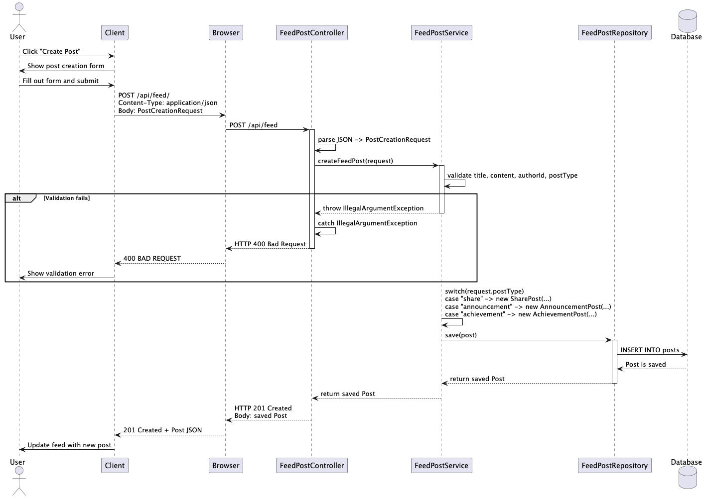
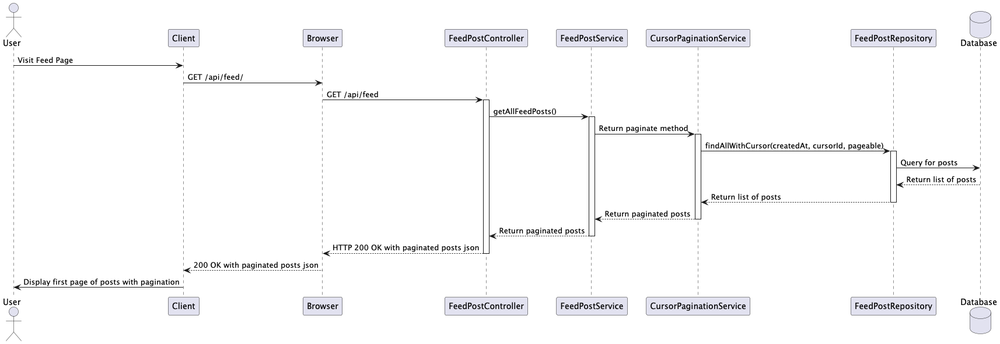
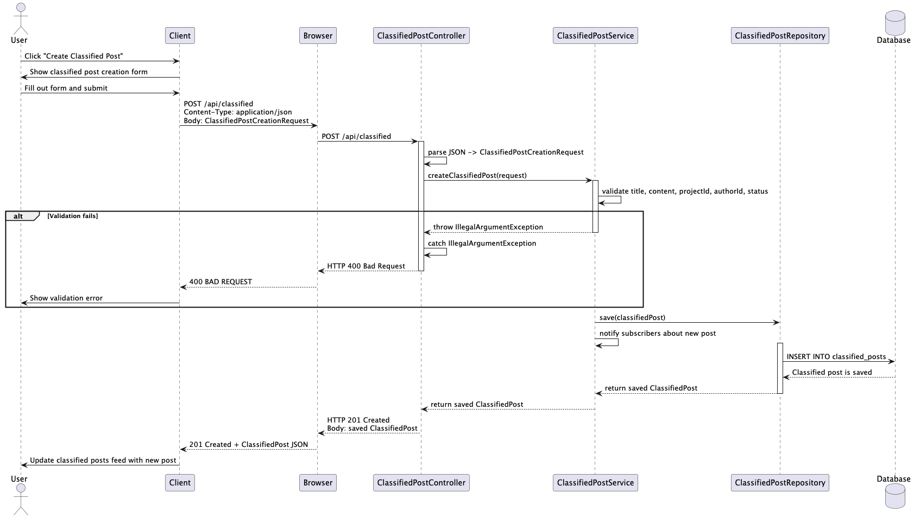
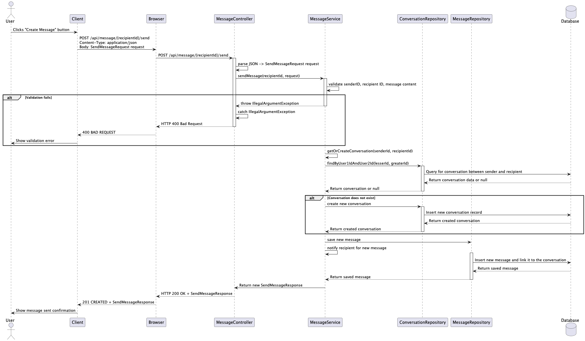
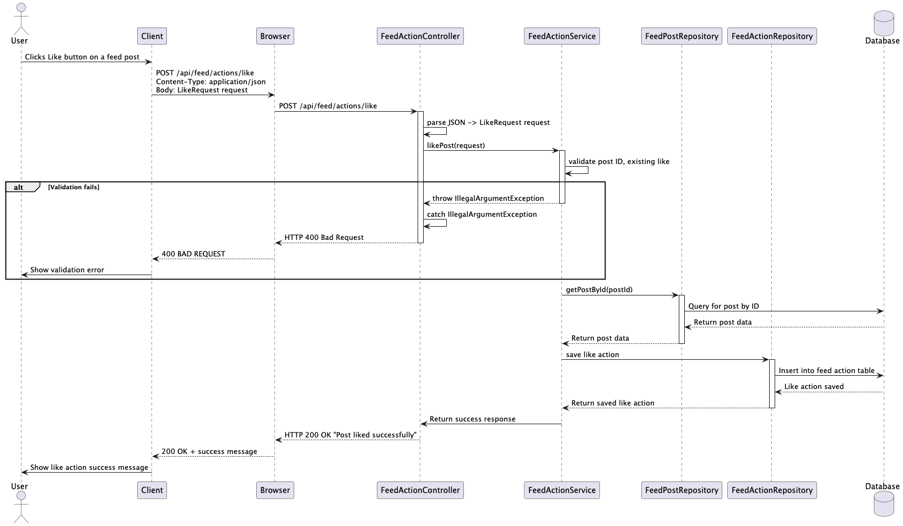

# ConnectHub Service API Documentation

## Overview

The ConnectHub microservice for Hatchloom provides a set of API endpoints
to manage user posts of different types (share, announcement, achievement),
creating feed actions such as likes and comments, and managing
classified posts which are to be part of the Launchpad service.

## Features

- Create and manage user posts (share, announcement, achievement)
- Create feed actions (like, comment)
- Manage classified posts for Launchpad
- Filtering classified posts status
- Integrate with other services such as User Service and Launchpad
- Pagination support
- Notification system for classified post updates and messages

---

## Table of Contents

1. [Feed Post Service](#feed-post-service)
2. [Classified Post Service](#classified-post-service)
3. [Feed Action Service](#feed-action-service)
4. [Message Service](#message-service)
5. [Notification Service](#notification-service)

---

## General Diagram Functionality

### Creating a post



### Getting posts



### Creating a classified post



### Create a message



### Create a feed action

## 

## Feed Post Service

### Overview

The Feed Post Service manages the creation, retrieval, and deletion of user posts in the feed. It supports three types of posts: Share, Announcement, and Achievement.

### Service Methods

#### 1. Create Feed Post

- **Method**: `createFeedPost(PostCreationRequest request)`
- **Description**: Creates a new feed post of a specified type (share, announcement, or achievement)
- **Returns**: `Post` object
- **Validation**:
  - Title must not be null or blank
  - Content must not be null or blank
  - Author ID must not be null
  - Post type must be one of: "share", "announcement", "achievement"

#### 2. Delete Feed Post

- **Method**: `deleteFeedPost(Integer postId, Integer userId)`
- **Description**: Deletes a feed post (only the author can delete their own post)
- **Returns**: void
- **Validation**:
  - Post ID must not be null
  - User ID must not be null
  - Post must exist
  - User must be the author of the post

#### 3. Get Feed Posts

- **Method**: `getFeedPosts()`
- **Description**: Retrieves all feed posts using pagination
- **Returns**: `CursorResponse<FeedPostResponse>`

---

### REST API Endpoints

#### POST `/api/feed`

**Create a new feed post**

**Headers**:

- `Authorization: Bearer <token>` (required)

**Request Body**:

```json
{
  "basePost": {
    "title": "Post title",
    "content": "Post content"
  },
  "postType": "share"
}
```

**Post Types**: `share`, `announcement`, `achievement`

Note: `authorId` is resolved from the Bearer token - it must not be included in the request body.

**Response** (201 Created):

```json
{
  "id": 1,
  "title": "Post title",
  "content": "Post content",
  "author": "550e8400-e29b-41d4-a716-446655440001",
  "createdAt": "2026-03-08T10:30:00",
  "postType": "share"
}
```

**Error Response** (400 Bad Request):

```json
null
```

---

#### GET `/api/feed`

**Get all feed posts**

**Headers**:

- `Authorization: Bearer <token>` (required)

**Query Parameters**:

- `limit` (Integer, optional) - Number of posts to return (default: 25)
- `after` (String, optional) - Cursor value for pagination

**Response** (200 OK):

```json
{
  "data": [
    {
      "id": 1,
      "title": "Post title",
      "content": "Post content",
      "author": "550e8400-e29b-41d4-a716-446655440001",
      "postType": "share",
      "createdAt": "2026-03-08T10:30:00",
      "likeCount": 5,
      "commentCount": 2,
      "likedByCurrentUser": false,
      "comments": [
        {
          "id": 10,
          "postId": 1,
          "userId": "550e8400-e29b-41d4-a716-446655440002",
          "commentText": "Great post!",
          "createdAt": "2026-03-08T11:00:00"
        }
      ]
    }
  ],
  "nextCursor": "cursorValue in base64",
  "hasNext": true
}
```

---

#### DELETE `/api/feed/{postId}`

**Delete a feed post**

**Headers**:

- `Authorization: Bearer <token>` (required)

**Path Parameters**:

- `postId` (Integer) - ID of the post to delete

Note: The requesting user's ID is resolved from the Bearer token.

**Response** (200 OK):

```json
"Post deleted successfully"
```

**Error Response** (400 Bad Request):

```json
"Error message"
```

---

## Classified Post Service

### Overview

The Classified Post Service manages classified posts intended for the Launchpad service. These posts are associated with projects and have status tracking (open, filled, closed).

### Service Methods

#### 1. Create Classified Post

- **Method**: `createClassifiedPost(ClassifiedPostCreationRequest request)`
- **Description**: Creates a new classified post linked to a project
- **Returns**: `ClassifiedPost` object
- **Validation**:
  - Title must not be null or empty (max 255 characters)
  - Content must not be null or empty (max 3000 characters)
  - Author ID must not be null
  - Project ID must not be null and must be positive
  - Status must be one of: "open", "filled", "closed"

#### 2. Get Classified Post by ID

- **Method**: `getClassifiedById(Integer postId)`
- **Description**: Retrieves a specific classified post by its ID
- **Returns**: `ClassifiedPost` object
- **Validation**:
  - Post ID must not be null and must be positive
  - Post must exist

#### 3. Filter Classified Posts by Status

- **Method**: `filterClassifiedPostsByStatus(String status)`
- **Description**: Retrieves all classified posts with the specified status
- **Returns**: `List<ClassifiedPost>`
- **Validation**:
  - Status must be one of: "open", "filled", "closed"

#### 4. Update Classified Post Status

- **Method**: `updateClassifiedPostStatus(Integer postId, Integer userId, String newStatus)`
- **Description**: Updates the status of a classified post (only the author can update)
- **Returns**: `ClassifiedPost` object
- **Validation**:
  - Post ID must not be null
  - User must be the author of the post
  - New status must be one of: "open", "filled", "closed"

#### 5. Get All Classified Posts

- **Method**: `getAllClassifiedPosts()`
- **Description**: Retrieves all classified posts using pagination
- **Returns**: `CursorResponse<ClassifiedPost>`

#### 6. Apply to Classified Post

- **Method**: `applyToClassifiedPost(Integer postId, Integer userId)`
- **Description**: Allows a user to apply to an open classified post
- **Returns**: void
- **Validation**:
  - Post ID must not be null
  - User ID must not be null
  - Post must exist and be in "open" status
  - User cannot apply to the same post multiple times
  - User cannot apply to their own post

#### 7. Get Applications for Classified Post

- **Method**: `getApplicationsForClassifiedPost(Integer postId, Integer userId)`
- **Description**: Retrieves all applications for a classified post
- **Returns**: `List<ClassifiedPostApplication>`
- **Validation**:
  - Post ID must not be null
  - User must be the author of the post
  - User cannot be null
  - Post must exist

#### 8. Get all applications by user

- **Method**: `getAppliedClassifiedPostsByUser(Integer userId)`
- **Description**: Retrieves all classified posts a user has applied to
- **Returns**: `List<ClassifiedPost>`
- **Validation**:
  - User ID must not be null
  - User must exist

---

### REST API Endpoints

#### POST `/api/classified`

**Create a new classified post**

**Headers**:

- `Authorization: Bearer <token>` (required)

**Request Body**:

```json
{
  "basePost": {
    "title": "Seeking Java Developer",
    "content": "Looking for an experienced Java developer for our project"
  },
  "projectId": 5,
  "status": "open"
}
```

Note: `authorId` is resolved from the Bearer token.

**Status Values**: `open`, `filled`, `closed`

**Response** (201 Created):

```json
{
  "id": 1,
  "title": "Seeking Java Developer",
  "content": "Looking for an experienced Java developer for our project",
  "author": 1,
  "projectId": 5,
  "status": "open",
  "createdAt": "2026-03-08T10:30:00",
  "updatedAt": "2026-03-08T10:30:00"
}
```

**Error Response** (400 Bad Request):

```json
null
```

---

#### GET `/api/classified`

** Get all classified posts**

** Query Parameters**:

- `limit` (Integer, optional) - Number of posts to return (default: 25)
- `after` (String, optional) - Cursor value for pagination
- `statusType` (String, optional) - Filter by status type (default: `open`)

**Response** (200 OK):

```json
{
  "data": [
    {
      "id": 1,
      "title": "Seeking Java Developer",
      "content": "Looking for an experienced Java developer for our project",
      "author": 1,
      "projectId": 5,
      "status": "open",
      "createdAt": "2026-03-22T11:30:00",
      "updatedAt": "2026-03-22T11:30:00"
    }
  ],
  "nextCursor": "cursorValue in base64",
  "hasNext": true
}
```

**Error Response** (400 Bad Request):

```json
null
```

---

#### GET `/api/classified/{postId}`

**Get a specific classified post**

**Path Parameters**:

- `postId` (Integer) - ID of the classified post

**Response** (200 OK):

```json
{
  "id": 1,
  "title": "Seeking Java Developer",
  "content": "Looking for an experienced Java developer for our project",
  "author": 1,
  "projectId": 5,
  "status": "open",
  "createdAt": "2026-03-22T11:30:00",
  "updatedAt": "2026-03-22T11:30:00"
}
```

**Error Response** (400 Bad Request):

```json
null
```

---

#### GET `/api/classified/filtered`

**Get classified posts filtered by status**

**Query Parameters**:

- `statusType` (String) - Status to filter by (`open`, `filled`, or `closed`)

**Response** (200 OK):

```json
[
  {
    "id": 1,
    "title": "Seeking Java Developer",
    "content": "Looking for an experienced Java developer for our project",
    "author": 1,
    "projectId": 5,
    "status": "open",
    "createdAt": "2026-03-22T11:30:00",
    "updatedAt": "2026-03-22T11:30:00"
  }
]
```

**Error Response** (400 Bad Request):

```json
null
```

---

#### PUT `/api/classified/{postId}/status`

**Update the status of a classified post**

**Headers**:

- `Authorization: Bearer <token>` (required)

**Path Parameters**:

- `postId` (Integer) - ID of the classified post

**Request Body**:

```json
{
  "newStatus": "filled"
}
```

Note: The requesting user's ID is resolved from the Bearer token. Only the post author can update.

**Response** (200 OK):

```json
{
  "id": 1,
  "title": "Seeking Java Developer",
  "content": "Looking for an experienced Java developer for our project",
  "author": 1,
  "projectId": 5,
  "status": "filled",
  "createdAt": "2026-03-22T11:30:00",
  "updatedAt": "2026-03-22T11:30:00"
}
```

**Error Response** (400 Bad Request):

```json
null
```

---

#### POST `/api/classified/subscriptions`

**Subscribe to classified post notifications**

**Headers**:

- `Authorization: Bearer <token>` (required)

Note: The subscribing user's ID is resolved from the Bearer token.

**Response** (201 Created):

```json
"Subscribed successfully"
```

**Error Response** (400 Bad Request):

```json
"Error message"
```

---

#### DELETE `/api/classified/subscriptions`

**Unsubscribe from classified post notifications**

**Headers**:

- `Authorization: Bearer <token>` (required)

Note: The user's ID is resolved from the Bearer token.

**Response** (200 OK):

```json
"Unsubscribed successfully"
```

**Error Response** (400 Bad Request):

```json
"Error message"
```

---

#### GET `/api/classified/by-position/{positionId}`

**Get the classified post linked to a specific LaunchPad position**

Used by the LaunchPad frontend to check whether a position already has a classified post.

**Path Parameters**:

- `positionId` (UUID) - ID of the LaunchPad position

**Response** (200 OK) - the linked `ClassifiedPost` object, or `404` if none.

---

#### POST `/api/classified/{postId}/apply`

**Apply to an open classified post**

**Headers**:

- `Authorization: Bearer <token>` (required)

**Path Parameters**:

- `postId` (Integer) - ID of the classified post

Note: The applicant's user ID is resolved from the Bearer token.

**Response** (200 OK):

```json
"Application submitted successfully"
```

**Error Response** (400 Bad Request):

```json
"Error message"
```

---

#### GET `/api/classified/{postId}/applications`

**Get all applications for a classified post**

**Headers**:

- `Authorization: Bearer <token>` (required)

**Path Parameters**:

- `postId` (Integer) - ID of the classified post

Note: The requesting user's ID is resolved from the Bearer token. Only the post author can view applications.

**Response** (200 OK):

```json
[
  {
    "id": 1,
    "postId": 5,
    "userId": "550e8400-e29b-41d4-a716-446655440001",
    "status": "APPLIED",
    "appliedAt": "2026-03-22T11:30:00"
  }
]
```

**Error Response** (400 Bad Request):

```json
null
```

---

#### GET `/api/classified/applications/me`

**Get all classified posts the authenticated user has applied to, plus their total application count**

**Headers**:

- `Authorization: Bearer <token>` (required)

Note: The user's ID is resolved from the Bearer token.

**Response** (200 OK):

```json
{
  "classifiedPosts": [
    {
      "id": 1,
      "title": "Seeking Java Developer",
      "content": "Looking for an experienced Java developer for our project",
      "author": "550e8400-e29b-41d4-a716-446655440001",
      "projectId": 5,
      "status": "open",
      "createdAt": "2026-03-22T11:30:00",
      "updatedAt": "2026-03-22T11:30:00"
    }
  ],
  "totalApplications": 3
}
```

**Error Response** (400 Bad Request):

```json
null
```

---

## Feed Action Service

### Overview

The Feed Action Service manages interactions with feed posts, including likes and comments. It supports liking posts, commenting on posts, liking comments, and retrieving action statistics.

### Service Methods

#### 1. Like a Post

- **Method**: `likePost(LikeRequest request)`
- **Description**: Adds a like to a post from a specific user
- **Returns**: void
- **Validation**:
  - Post must exist
  - User cannot like the same post twice

#### 2. Unlike a Post

- **Method**: `unlikePost(Integer postId, Integer userId)`
- **Description**: Removes a user's like from a post
- **Returns**: void
- **Validation**:
  - User must have already liked the post

#### 3. Add Comment

- **Method**: `addComment(CommentRequest request)`
- **Description**: Adds a comment to a post
- **Returns**: void
- **Validation**:
  - Post must exist
  - Comment text must not be null or empty

#### 4. Delete Comment

- **Method**: `deleteComment(Integer commentId, Integer userId)`
- **Description**: Deletes a comment (comment author or post author can delete)
- **Returns**: void
- **Validation**:
  - Comment must exist
  - User must be either the comment author or the post author

#### 5. Like a Comment

- **Method**: `likeComment(Integer commentId, Integer userId)`
- **Description**: Adds a like to a specific comment
- **Returns**: `FeedAction` object
- **Validation**:
  - Comment must exist
  - User cannot like the same comment twice

#### 6. Unlike a Comment

- **Method**: `unlikeComment(Integer commentId, Integer userId)`
- **Description**: Removes a user's like from a comment
- **Returns**: void
- **Validation**:
  - User must have already liked the comment

#### 7. Get Post Actions

- **Method**: `getPostActions(Integer postId, Integer currentUserId)`
- **Description**: Retrieves all actions (likes and comments) for a specific post
- **Returns**: `PostActionsResponse` object
- **Validation**:
  - Post must exist

#### 8. Get Comments by Post ID

- **Method**: `getCommentsByPostId(Integer postId)`
- **Description**: Retrieves all comments for a specific post
- **Returns**: `List<CommentResponse>`

#### 9. Get Likes Count

- **Method**: `getLikesCount(Integer postId)`
- **Description**: Gets the number of likes on a post
- **Returns**: `Long`

#### 10. Get Comment Likes Count

- **Method**: `getCommentLikesCount(Integer commentId)`
- **Description**: Gets the number of likes on a comment
- **Returns**: `Long`

---

### REST API Endpoints

#### POST `/api/feed/actions/like`

**Like a post**

**Headers**:

- `Authorization: Bearer <token>` (required)

**Request Body**:

```json
{
  "postId": 5
}
```

Note: The userId is resolved from the Bearer token.

**Response** (201 Created):

```json
"Post liked successfully"
```

**Error Response** (400 Bad Request):

```json
"Error message"
```

---

#### DELETE `/api/feed/actions/like`

**Unlike a post**

**Headers**:

- `Authorization: Bearer <token>` (required)

**Query Parameters**:

- `postId` (Integer) - ID of the post

Note: The userId is resolved from the Bearer token.

**Response** (200 OK):

```json
"Post unliked successfully"
```

**Error Response** (400 Bad Request):

```json
"Error message"
```

---

#### POST `/api/feed/actions/comment`

**Add a comment to a post**

**Headers**:

- `Authorization: Bearer <token>` (required)

**Request Body**:

```json
{
  "postId": 5,
  "commentText": "Great post!"
}
```

Note: The userId is resolved from the Bearer token.

**Response** (201 Created):

```json
{
  "id": 10,
  "postId": 5,
  "userId": "550e8400-e29b-41d4-a716-446655440001",
  "commentText": "Great post!",
  "createdAt": "2026-03-08T10:30:00"
}
```

**Error Response** (400 Bad Request):

```json
null
```

---

#### DELETE `/api/feed/actions/comment/{commentId}`

**Delete a comment**

**Headers**:

- `Authorization: Bearer <token>` (required)

**Path Parameters**:

- `commentId` (Integer) - ID of the comment

Note: The userId is resolved from the Bearer token.

**Response** (200 OK):

```json
"Comment deleted successfully"
```

**Error Response** (400 Bad Request):

```json
"Error message"
```

---

#### GET `/api/feed/actions/post/{postId}`

**Get all actions for a post (likes, comments, etc.)**

**Headers**:

- `Authorization: Bearer <token>` (required)

**Path Parameters**:

- `postId` (Integer) - ID of the post

Note: The current user's ID is resolved from the Bearer token (used to check if they liked the post).

**Response** (200 OK):

```json
{
  "postId": 5,
  "likesCount": 10,
  "commentsCount": 3,
  "comments": [
    {
      "id": 1,
      "postId": 5,
      "userId": "550e8400-e29b-41d4-a716-446655440002",
      "commentText": "Great post!",
      "createdAt": "2026-03-08T10:30:00"
    }
  ],
  "isLikedByCurrentUser": true
}
```

**Error Response** (400 Bad Request):

```json
"Error message"
```

---

#### GET `/api/feed/actions/post/{postId}/comments`

**Get all comments for a post**

**Path Parameters**:

- `postId` (Integer) - ID of the post

**Response** (200 OK):

```json
[
  {
    "id": 1,
    "postId": 5,
    "userId": "550e8400-e29b-41d4-a716-446655440002",
    "commentText": "Great post!",
    "createdAt": "2026-03-08T10:30:00"
  }
]
```

**Error Response** (400 Bad Request):

```json
"Error message"
```

---

#### GET `/api/feed/actions/post/{postId}/likes/count`

**Get the number of likes on a post**

**Path Parameters**:

- `postId` (Integer) - ID of the post

**Response** (200 OK):

```json
10
```

**Error Response** (400 Bad Request):

```json
"Error message"
```

---

#### POST `/api/feed/actions/comment/{commentId}/like`

**Like a comment**

**Headers**:

- `Authorization: Bearer <token>` (required)

**Path Parameters**:

- `commentId` (Integer) - ID of the comment

Note: The userId is resolved from the Bearer token.

**Response** (201 Created):

```json
{
  "id": 15,
  "postId": 5,
  "userId": "550e8400-e29b-41d4-a716-446655440001",
  "actionType": "like",
  "commentText": null,
  "parentActionId": 10,
  "createdAt": "2026-03-08T10:30:00"
}
```

**Error Response** (400 Bad Request):

```json
"Error message"
```

---

#### DELETE `/api/feed/actions/comment/{commentId}/like`

**Unlike a comment**

**Headers**:

- `Authorization: Bearer <token>` (required)

**Path Parameters**:

- `commentId` (Integer) - ID of the comment

Note: The userId is resolved from the Bearer token.

**Response** (200 OK):

```json
"Comment unliked successfully"
```

**Error Response** (400 Bad Request):

```json
"Error message"
```

---

#### GET `/api/feed/actions/comment/{commentId}/likes/count`

**Get the number of likes on a comment**

**Path Parameters**:

- `commentId` (Integer) - ID of the comment

**Response** (200 OK):

```json
5
```

**Error Response** (400 Bad Request):

```json
"Error message"
```

---

## Message Service

### Overview

The message service manages message creation, conversation creation, retrieving messages for a conversation

### Service Methods

#### 1. Create a Message

- **Method**: `sendMessage(Integer conversationId, Integer recipientId, String content)`
- **Description**: Sends a message in a conversation
- **Returns**: `SendMessageResponse` object
- **Validation**:
  - Sender ID is required
  - Recipient ID is required
  - Content must not be null or empty
  - Sender or recipient must be a participant of the conversation

#### 2. Create a Conversation

- **Method**: `getOrCreateConversation(Integer senderId, Integer recipientId)`
- **Description**: Retrieves an existing conversation between two users or creates a new one if it doesn't exist
- **Returns**: `Conversations` object
- **Validation**:
  - Sender ID is required
  - Recipient ID is required
  - Sender and recipient cannot be the same user

#### 3. Get Messages for Conversation

- **Method**: `getConversationMessages(Integer conversationId, Integer userId)`
- **Description**: Retrieves all messages for a specific conversation
- **Returns**: `List<MessageResponse>` object
- **Validation**:
  - Conversation ID is required
  - User must be a participant of the conversation

---

### REST API Endpoints

#### POST `/api/message/{recipientId}/send`

**Send a message**

**Headers**:

- `Authorization: Bearer <token>` (required)

**Path Parameters**:

- `recipientId` (UUID) - ID of the receiving user

**Request Body**:

```json
{
  "conversationId": "550e8400-e29b-41d4-a716-446655440005",
  "content": "Hi there"
}
```

Note: `senderId` is resolved from the Bearer token.

**Response** (201 CREATED):

```json
{
  "conversationId": "550e8400-e29b-41d4-a716-446655440005",
  "messageId": "550e8400-e29b-41d4-a716-446655440010",
  "senderId": "550e8400-e29b-41d4-a716-446655440001",
  "recipientId": "550e8400-e29b-41d4-a716-446655440002",
  "content": "Hi there",
  "createdAt": "2026-03-22T11:30:00"
}
```

**Error Response** (400 Bad Request):

```json
null
```

#### GET `/api/message/conversation/`

**Get all conversations for the authenticated user**

**Headers**:

- `Authorization: Bearer <token>` (required)

Note: The user's ID is resolved from the Bearer token.

**Response** (200 OK):

```json
[
  {
    "conversationId": "550e8400-e29b-41d4-a716-446655440005",
    "otherUserId": "550e8400-e29b-41d4-a716-446655440002",
    "lastMessage": "Hi there",
    "updatedAt": "2026-03-22T11:30:00"
  }
]
```

**Error Response** (400 Bad Request):

```json
null
```

#### GET `/api/message/conversation/{conversationId}`

**Get messages for a conversation**

**Headers**:

- `Authorization: Bearer <token>` (required)

**Path Parameters**:

- `conversationId` (UUID) - ID of the conversation

Note: The user's ID is resolved from the Bearer token. The user must be a participant of the conversation.

**Response** (200 OK):

```json
[
  {
    "id": "550e8400-e29b-41d4-a716-446655440010",
    "conversationId": "550e8400-e29b-41d4-a716-446655440005",
    "senderId": "550e8400-e29b-41d4-a716-446655440001",
    "content": "Hi there",
    "createdAt": "2026-03-22T11:30:00"
  }
]
```

**Error Response** (400 Bad Request):

```json
null
```

---

## Notification Service

### Overview

This service manages the creation and retrieval of notifications for users

### Service Methods

#### 1. Create Notification

- **Method**: `createNotification(NotificationBuilder builder)`
- **Description**: Creates a new notification based on the provided builder object
- **Returns**: void

#### 2. Get Classified Notifications for User

- **Method**: `getClassifiedNotifications(Integer userId, boolean unread)`
- **Description**: Retrieves classified post notifications for a user, with an option to filter by unread status
- **Returns**: `List<NotificationResponse>`

#### 3. Get Message Notifications for User

- **Method**: `getMessageNotifications(Integer userId, boolean unread)`
- **Description**: Retrieves message notifications for a user, with an option to filter by unread
- **Returns**: `List<NotificationResponse>`

#### 4. Mark Notification as Read

- **Method**: `markAsRead(Integer notificationId, Integer userId)`
- **Description**: Marks a specific notification as read for a user
- **Returns**: void
- **Validation**:
  - Notification must exist
  - Notification must belong to the user

---

### REST API Endpoints

#### GET `/api/notifications/all`

**Get a summary of all notifications (classified + message) for the authenticated user**

**Headers**:

- `Authorization: Bearer <token>` (required)

**Query Parameters**:

- `unread` (boolean, optional) - Filter by unread notifications (default: true)
- `limit` (Integer, optional) - Max notifications per type (default: 5)

Note: The user's ID is resolved from the Bearer token.

**Response** (200 OK) - `NotificationSummaryResponse` containing classified and message notifications.

---

#### GET `/api/notifications/classified`

**Get classified post notifications for the authenticated user**

**Headers**:

- `Authorization: Bearer <token>` (required)

**Query Parameters**:

- `unread` (boolean) - Filter by unread notifications

Note: The user's ID is resolved from the Bearer token.

**Response** (200 OK):

```json
[
  {
    "id": 5,
    "recipientId": "550e8400-e29b-41d4-a716-446655440002",
    "senderUserId": "550e8400-e29b-41d4-a716-446655440001",
    "type": "CLASSIFIED_CREATED",
    "message": "A new classified post has been created",
    "classifiedPostId": 10,
    "conversationId": null,
    "isRead": false,
    "createdAt": "2026-03-22T11:30:00",
    "readAt": null
  }
]
```

---

#### GET `/api/notifications/messages`

**Get message notifications for the authenticated user**

**Headers**:

- `Authorization: Bearer <token>` (required)

**Query Parameters**:

- `unread` (boolean) - Filter by unread notifications

Note: The user's ID is resolved from the Bearer token.

**Response** (200 OK):

```json
[
  {
    "id": 6,
    "recipientId": "550e8400-e29b-41d4-a716-446655440002",
    "senderUserId": "550e8400-e29b-41d4-a716-446655440001",
    "type": "MESSAGE",
    "message": "Hey there",
    "classifiedPostId": null,
    "conversationId": "550e8400-e29b-41d4-a716-446655440005",
    "isRead": false,
    "createdAt": "2026-03-22T11:30:00",
    "readAt": null
  }
]
```

---

#### PATCH `/api/notifications/{notificationId}/read`

**Mark a notification as read**

**Headers**:

- `Authorization: Bearer <token>` (required)

**Path Parameters**:

- `notificationId` (Integer) - ID of the notification

Note: The user's ID is resolved from the Bearer token. The notification must belong to the authenticated user.

**Response** (200 OK):

```json
"Notification marked as read"
```

**Error Response** (400 Bad Request):

```json
"Error message"
```
