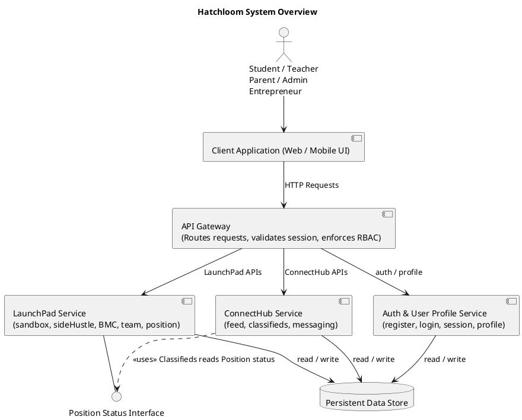
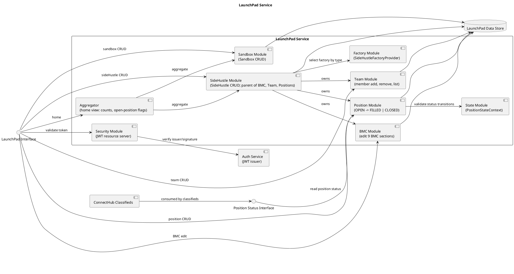
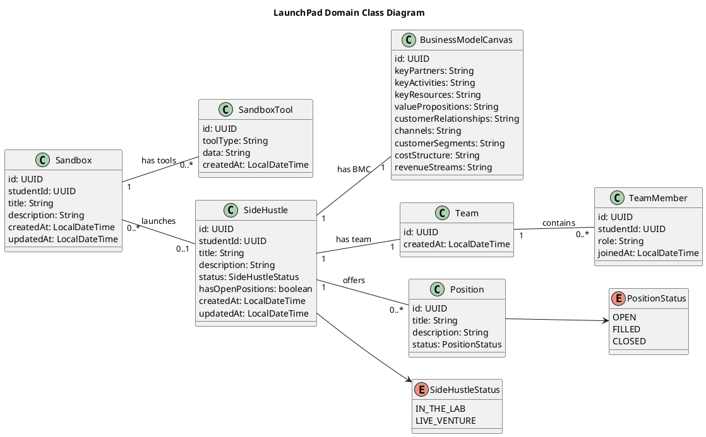
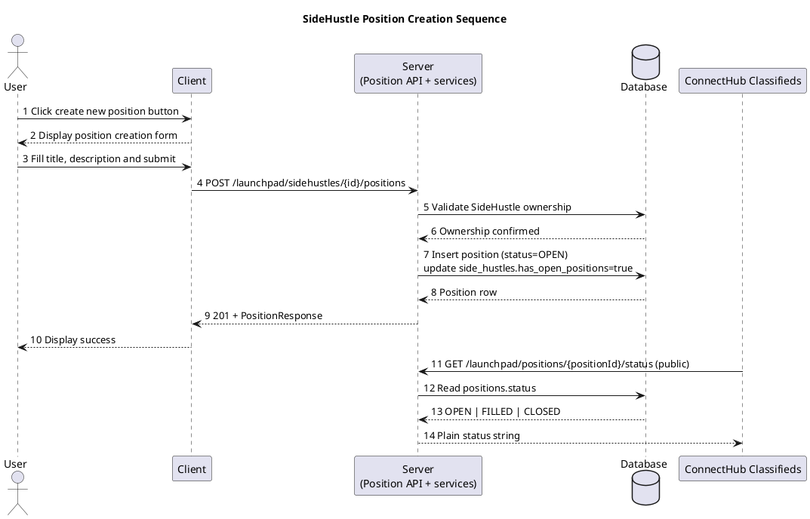
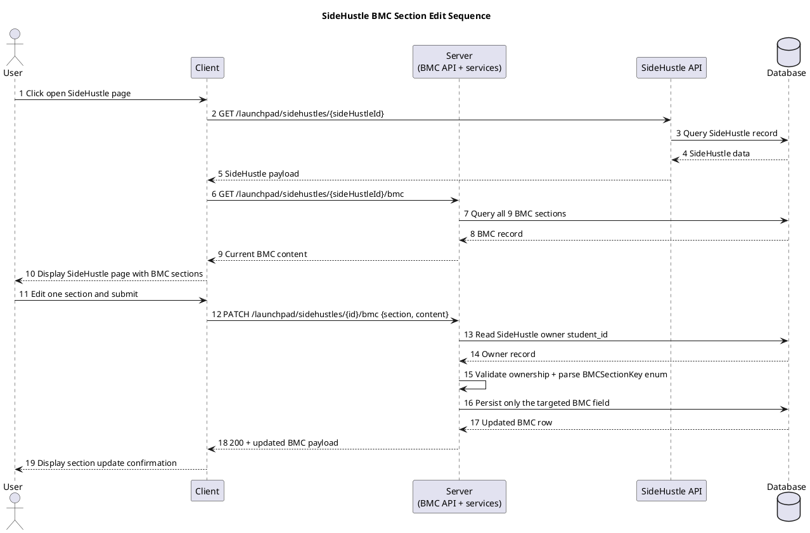

# Hatchloom Backend - LaunchPad Service

The LaunchPad Service is a Spring Boot REST API that manages a student's entrepreneurial workspace. It owns Sandboxes (idea labs), SideHustles (real ventures), the tools attached to sandboxes, Business Model Canvases, Teams, and Positions. It is one service in the broader Hatchloom platform.

---

## Table of Contents

1. [Key Design Choices](#1-key-design-choices)
2. [System Context](#2-system-context)
3. [Service Architecture](#3-service-architecture)
4. [Domain Model](#4-domain-model)
5. [Package Structure](#5-package-structure)
6. [API Reference](#6-api-reference)
7. [Design Patterns](#7-design-patterns)
8. [Security Model](#8-security-model)
9. [Database & Migrations](#9-database--migrations)
10. [Cross-Service Contracts](#10-cross-service-contracts)
11. [Running Locally](#11-running-locally)
12. [Docker & Deployment](#12-docker--deployment)

---

## 1. Key Design Choices

### Spring Boot 4 + Java 21

Java 21 virtual threads (Project Loom) are available and the framework is Spring Boot 4. The service is a standard MVC application - controllers receive HTTP, delegate to services, services call repositories. No reactive stack is used; the domain logic is straightforward CRUD with a few state machines.

### Flyway owns the schema, Hibernate only validates

`spring.jpa.hibernate.ddl-auto=validate`. The database schema is a first-class citizen managed by versioned Flyway migration scripts under `src/main/resources/db/migration`. Hibernate is not allowed to alter the schema. This ensures reproducible environments and safe production migrations.

### Stateless JWT security

The service is a pure OAuth2 Resource Server - it validates tokens but never issues them. Every protected endpoint reads the `sub` claim from the Bearer JWT to identify the caller. The Auth service (external) is the sole token issuer. Sessions are disabled.

### Ownership validation in the service layer

Resource ownership (e.g. "does this student own this SideHustle?") is checked inside service methods, not in controllers or security filters. This keeps the check co-located with the mutation logic and makes it easy to test in isolation.

### State pattern for Position lifecycle

A `Position` moves through a strict lifecycle: `OPEN → FILLED` or `OPEN → CLOSED`. FILLED and CLOSED are terminal. This is modelled with the **State** pattern - each status has a concrete state class that either permits or rejects the requested transition, throwing `IllegalStateException` for illegal moves.

### Factory pattern for SideHustle creation

A `SideHustle` can be created as `IN_THE_LAB` or `LIVE_VENTURE`. The **Factory** pattern (via `SideHustleFactoryProvider`) encapsulates the creation logic for each type. When a SideHustle is created, the factory also auto-creates an empty `BusinessModelCanvas` and an empty `Team` so every venture always has these resources available.

### Facade pattern for home aggregation

`LaunchPadAggregator` is a Facade - a single component that assembles the home-page view by calling `SandboxService` and `SideHustleService` and computing counts. Controllers stay thin; they call the aggregator rather than orchestrating multiple services themselves.

---

## 2. System Context

The LaunchPad Service sits behind an API Gateway and integrates with two external services:

- **Auth Service** - issues JWTs; LaunchPad validates signatures against the Auth issuer URI.
- **ConnectHub Service** - consumes the public `GET /launchpad/positions/{positionId}/status` endpoint to display open positions in its classifieds feed.



> Source: [`../diagrams/component_overview.puml`](../diagrams/component_overview.puml)

---

## 3. Service Architecture

Internally, the LaunchPad Service is composed of focused modules. Each feature area has its own controller, service, and repository. Cross-cutting concerns (security, aggregation, factories, state) live in dedicated packages.



> Source: [`../diagrams/component_launchpad.puml`](../diagrams/component_launchpad.puml)

### Layer responsibilities

| Layer          | Responsibility                                                                          |
| -------------- | --------------------------------------------------------------------------------------- |
| **Controller** | HTTP binding only - parse path/body, call service or aggregator, return response DTO    |
| **Service**    | Business logic - ownership validation, state transitions, factory dispatch, persistence |
| **Aggregator** | Read-only facade - compose multi-service views without adding persistence               |
| **Repository** | Data access - extends `JpaRepository`, custom queries for ownership lookups             |
| **Factory**    | Object creation - encapsulate SideHustle subtype construction                           |
| **State**      | Lifecycle enforcement - model valid Position status transitions                         |

---

## 4. Domain Model



> Source: [`../diagrams/class_launchpad_domain.puml`](../diagrams/class_launchpad_domain.puml)

### Key domain rules

- A `Sandbox` is a student's experimental workspace. It holds many `SandboxTool` records, each storing a JSON blob of tool-specific content.
- A `SideHustle` can optionally reference a parent `Sandbox` (the idea it grew from). If that Sandbox is deleted, all linked SideHustles are deleted as well.
- Every `SideHustle` always has exactly one `BusinessModelCanvas` and one `Team`, both auto-created at creation time with all fields null/empty.
- `Position.hasOpenPositions` on `SideHustle` is a denormalised flag maintained by `PositionService` - set to `true` on position creation, recalculated after every status update.
- `PositionStatus` transitions are strictly one-way: `OPEN → FILLED` or `OPEN → CLOSED`. `FILLED` and `CLOSED` are terminal.

---

## 5. Package Structure

```text
com.hatchloom.launchpad/
├── LaunchpadApplication.java
│
├── aggregator/                      # Facade: compose home view from multiple services
│   ├── LaunchPadAggregator.java
│   └── dto/
│       ├── LaunchPadHomeView.java
│       ├── SandboxSummary.java
│       └── SideHustleSummary.java
│
├── config/
│   ├── SecurityConfig.java          # OAuth2 resource server + public endpoint list
│   ├── JwtDecoderConfig.java        # JWT decoder pointing to Auth service OIDC discovery
│   ├── DevSecurityConfig.java       # Dev profile: disables JWT validation (SPRING_PROFILES_ACTIVE=dev)
│   └── DevAuthFilter.java           # Dev profile: injects synthetic user principal for local testing
│
├── controller/                      # HTTP layer - one controller per resource
│   ├── LaunchPadHomeController.java
│   ├── SandboxController.java
│   ├── SandboxToolController.java
│   ├── SideHustleController.java
│   ├── PositionController.java
│   ├── BMCController.java
│   └── TeamController.java
│
├── dto/
│   ├── request/                     # Validated inbound payloads
│   └── response/                    # Outbound API shapes (never expose entities directly)
│
├── factory/                         # Factory pattern: SideHustle subtype creation
│   ├── SideHustleFactory.java       # Abstract factory
│   ├── InTheLabSideHustleFactory.java
│   ├── LiveVentureSideHustleFactory.java
│   └── SideHustleFactoryProvider.java
│
├── model/                           # JPA entities
│   ├── Sandbox.java
│   ├── SandboxTool.java
│   ├── SideHustle.java
│   ├── BusinessModelCanvas.java
│   ├── Team.java
│   ├── TeamMember.java
│   ├── Position.java
│   └── enums/
│       ├── SideHustleStatus.java
│       ├── PositionStatus.java
│       └── BMCSectionKey.java
│
├── repository/                      # Spring Data JPA interfaces
│   ├── SandboxRepository.java
│   ├── SandboxToolRepository.java
│   ├── SideHustleRepository.java
│   ├── BusinessModelCanvasRepository.java
│   ├── TeamRepository.java
│   ├── TeamMemberRepository.java
│   └── PositionRepository.java
│
├── service/                         # Business logic layer
│   ├── SandboxService.java
│   ├── SandboxToolService.java
│   ├── SideHustleService.java
│   ├── BMCService.java
│   ├── TeamService.java
│   └── PositionService.java
│
└── state/                           # State pattern: Position lifecycle
    ├── PositionState.java           # Interface: transitionToFilled(), transitionToClosed()
    ├── PositionStateContext.java    # Spring bean: resolves state, executes transition
    ├── OpenState.java               # Allows both transitions
    ├── FilledState.java             # Terminal - rejects all transitions
    └── ClosedState.java             # Terminal - rejects all transitions
```

---

## 6. API Reference

All endpoints require a valid `Authorization: Bearer <JWT>` header unless marked **public**.

### Home

| Method | Path                       | Auth | Response                                                        |
| ------ | -------------------------- | ---- | --------------------------------------------------------------- |
| `GET`  | `/launchpad/home/{userId}` | JWT  | `LaunchPadHomeView` - sandbox + sideHustle counts and summaries |

### Sandboxes

| Method   | Path                               | Auth | Body                   | Response                |
| -------- | ---------------------------------- | ---- | ---------------------- | ----------------------- |
| `POST`   | `/launchpad/sandboxes`             | JWT  | `CreateSandboxRequest` | `201 SandboxResponse`   |
| `GET`    | `/launchpad/sandboxes/{sandboxId}` | JWT  | -                      | `SandboxResponse`       |
| `PUT`    | `/launchpad/sandboxes/{sandboxId}` | JWT  | `UpdateSandboxRequest` | `SandboxResponse`       |
| `DELETE` | `/launchpad/sandboxes/{sandboxId}` | JWT  | -                      | `204`                   |
| `GET`    | `/launchpad/sandboxes?studentId=`  | JWT  | -                      | `List<SandboxResponse>` |

### Sandbox Tools

| Method   | Path                                              | Auth | Body                       | Response                    |
| -------- | ------------------------------------------------- | ---- | -------------------------- | --------------------------- |
| `POST`   | `/launchpad/sandboxes/{sandboxId}/tools`          | JWT  | `CreateSandboxToolRequest` | `201 SandboxToolResponse`   |
| `GET`    | `/launchpad/sandboxes/{sandboxId}/tools`          | JWT  | -                          | `List<SandboxToolResponse>` |
| `PUT`    | `/launchpad/sandboxes/{sandboxId}/tools/{toolId}` | JWT  | `UpdateSandboxToolRequest` | `SandboxToolResponse`       |
| `DELETE` | `/launchpad/sandboxes/{sandboxId}/tools/{toolId}` | JWT  | -                          | `204`                       |

### SideHustles

| Method   | Path                                    | Auth | Body                      | Response                   |
| -------- | --------------------------------------- | ---- | ------------------------- | -------------------------- |
| `POST`   | `/launchpad/sidehustles`                | JWT  | `CreateSideHustleRequest` | `201 SideHustleResponse`   |
| `GET`    | `/launchpad/sidehustles/{sideHustleId}` | JWT  | -                         | `SideHustleResponse`       |
| `PUT`    | `/launchpad/sidehustles/{sideHustleId}` | JWT  | `UpdateSideHustleRequest` | `SideHustleResponse`       |
| `DELETE` | `/launchpad/sidehustles/{sideHustleId}` | JWT  | -                         | `204`                      |
| `GET`    | `/launchpad/sidehustles?studentId=`     | JWT  | -                         | `List<SideHustleResponse>` |

### Positions

| Method | Path                                                        | Auth       | Body                          | Response                           | Notes                        |
| ------ | ----------------------------------------------------------- | ---------- | ----------------------------- | ---------------------------------- | ---------------------------- |
| `POST` | `/launchpad/sidehustles/{id}/positions`                     | JWT        | `CreatePositionRequest`       | `200 PositionResponse`             | Sets `hasOpenPositions=true` |
| `GET`  | `/launchpad/sidehustles/{id}/positions`                     | JWT        | -                             | `List<PositionResponse>`           |                              |
| `PUT`  | `/launchpad/sidehustles/{id}/positions/{positionId}/status` | JWT        | `UpdatePositionStatusRequest` | `PositionResponse`                 | State machine enforced       |
| `GET`  | `/launchpad/positions/{positionId}/status`                  | **Public** | -                             | `"OPEN"` / `"FILLED"` / `"CLOSED"` | Position Status Interface    |

### Business Model Canvas

| Method  | Path                              | Auth | Body             | Response                       |
| ------- | --------------------------------- | ---- | ---------------- | ------------------------------ |
| `GET`   | `/launchpad/sidehustles/{id}/bmc` | JWT  | -                | `BMCResponse` (all 9 sections) |
| `PATCH` | `/launchpad/sidehustles/{id}/bmc` | JWT  | `EditBMCRequest` | `BMCResponse`                  |

### Team

| Method   | Path                                                | Auth | Body                   | Response                   |
| -------- | --------------------------------------------------- | ---- | ---------------------- | -------------------------- |
| `POST`   | `/launchpad/sidehustles/{id}/team/members`          | JWT  | `AddTeamMemberRequest` | `201 TeamMemberResponse`   |
| `GET`    | `/launchpad/sidehustles/{id}/team/members`          | JWT  | -                      | `List<TeamMemberResponse>` |
| `DELETE` | `/launchpad/sidehustles/{id}/team/members/{userId}` | JWT  | -                      | `204`                      |

### HTTP status codes

| Code  | Meaning                                                          |
| ----- | ---------------------------------------------------------------- |
| `200` | Successful GET / PUT / PATCH                                     |
| `201` | Successful POST (resource created)                               |
| `204` | Successful DELETE                                                |
| `400` | Invalid request body (bad section key, missing sandboxId, etc.)  |
| `401` | Missing or invalid JWT                                           |
| `403` | Caller does not own the resource                                 |
| `404` | Resource not found, or child does not belong to specified parent |
| `409` | Duplicate team membership                                        |

---

## 7. Design Patterns

### Facade - `LaunchPadAggregator`

Composes the LaunchPad home view by calling `SandboxService.listByStudent()` and `SideHustleService.listByStudent()` and computing counts. Controllers remain thin and never orchestrate multiple services directly.

```text
LaunchPadHomeController
        │
        ▼
LaunchPadAggregator.getHomeView(studentId)
        │
        ├─ SandboxService.listByStudent()   → SandboxSummary[]
        └─ SideHustleService.listByStudent() → SideHustleSummary[]
                                              + inTheLabCount
                                              + liveVenturesCount
```

### Factory - `SideHustleFactoryProvider`

Decouples SideHustle creation logic from the service. `SideHustleService` asks the provider for the right factory, then calls `createSideHustle(...)`.

```text
SideHustleService.createSideHustle(request)
        │
        ├─ factoryProvider.getFactory(IN_THE_LAB)   → InTheLabSideHustleFactory
        │       └─ createSideHustle(...)   status=IN_THE_LAB
        │
        └─ factoryProvider.getFactory(LIVE_VENTURE) → LiveVentureSideHustleFactory
                └─ createSideHustle(...)   status=LIVE_VENTURE

After factory creates entity:
  → auto-create empty BusinessModelCanvas
  → auto-create empty Team
```

### State - `PositionStateContext`

Enforces the `Position` lifecycle. `PositionService` passes the current status to the context, which resolves the appropriate state object and delegates the transition request. Terminal states throw `IllegalStateException`.



> Source: [`../diagrams/sequence_position.puml`](../diagrams/sequence_position.puml)

Valid transitions enforced by the state objects:

```text
        ┌─────────────────┐
        │      OPEN        │
        └────────┬────────┘
                 │
        ┌────────┴────────┐
        ▼                 ▼
   ┌─────────┐       ┌─────────┐
   │ FILLED  │       │ CLOSED  │
   │(terminal│       │(terminal│
   └─────────┘       └─────────┘
```

---

## 8. Security Model

Security is configured in `SecurityConfig`:

```text
Public (no token required):
  GET  /launchpad/positions/{positionId}/status
  GET  /actuator/health
  GET  /actuator/info
  GET  /swagger-ui/**
  GET  /v3/api-docs/**
  GET  /error

Everything else:
  Requires Authorization: Bearer <JWT>
  Session: STATELESS
  CSRF: disabled
```

JWT validation delegates to the Auth service via the `issuer-uri` configured in `application.properties`. The JWT `sub` claim (a UUID) is extracted in service methods that need to verify resource ownership.

**Ownership validation pattern (example from `PositionService`):**

```java
SideHustle sh = sideHustleService.findOrThrow(sideHustleId);
if (!sh.getStudentId().equals(callerId)) {
    throw new ResponseStatusException(HttpStatus.FORBIDDEN);
}
```

---

## 9. Database & Migrations

Flyway manages all schema changes. Migration files live in `src/main/resources/db/migration` and are applied in version order on startup. Hibernate runs in `validate` mode - it checks that the entity mappings match the current schema but never alters it.

Current schema baseline and updates:

- `V1__init_launchpad_schema.sql` creates the initial LaunchPad schema
- `V2__cascade_side_hustles_on_sandbox_delete.sql` updates `side_hustles.sandbox_id` to `ON DELETE CASCADE`

### Tables

| Table           | Entity                | Key columns                                                                     |
| --------------- | --------------------- | ------------------------------------------------------------------------------- |
| `sandboxes`     | `Sandbox`             | `id`, `student_id`, `title`, `description`                                      |
| `sandbox_tools` | `SandboxTool`         | `id`, `sandbox_id (FK)`, `tool_type`, `data (TEXT)`                             |
| `side_hustles`  | `SideHustle`          | `id`, `sandbox_id (FK, nullable)`, `student_id`, `status`, `has_open_positions` |
| `bmc_sections`  | `BusinessModelCanvas` | `id`, `side_hustle_id (FK, unique)`, 9 TEXT section columns                     |
| `teams`         | `Team`                | `id`, `side_hustle_id (FK, unique)`                                             |
| `team_members`  | `TeamMember`          | `id`, `team_id (FK)`, `student_id`, `role`; unique on `(team_id, student_id)`   |
| `positions`     | `Position`            | `id`, `side_hustle_id (FK)`, `title`, `status`                                  |

### Cascade rules

- `Sandbox` delete → cascades to `SandboxTool`
- `Sandbox` delete → cascades to linked `SideHustle`
- `SideHustle` delete → cascades to `BusinessModelCanvas`, `Team`, `TeamMember`, `Position`

---

## 10. Cross-Service Contracts

### BMC edit sequence



> Source: [`../diagrams/sequence_bmc.puml`](../diagrams/sequence_bmc.puml)

### Position Status Interface (for ConnectHub)

The one truly public endpoint in the service. ConnectHub calls it to determine whether a position listed in its classifieds feed is still open.

```text
GET /launchpad/positions/{positionId}/status
Authorization: none required
Response: plain text - "OPEN", "FILLED", or "CLOSED"
```

This endpoint is explicitly listed as `permitAll()` in `SecurityConfig` and is documented in the component diagram as the **Position Status Interface**.

---

## 11. Running Locally

**Prerequisites:** Java 21, Maven 3.9+, PostgreSQL 16 running locally.

```bash
# Start PostgreSQL (or use Docker)
docker run --rm -p 5432:5432 \
  -e POSTGRES_DB=launchpad_db \
  -e POSTGRES_USER=launchpad_user \
  -e POSTGRES_PASSWORD=launchpad_pass \
  postgres:16-alpine

# Run the service
cd backend
./mvnw spring-boot:run
```

Default configuration in `application.properties`:

```properties
spring.datasource.url=jdbc:postgresql://localhost:5432/launchpad_db
spring.datasource.username=launchpad_user
spring.datasource.password=launchpad_pass
spring.security.oauth2.resourceserver.jwt.issuer-uri=http://localhost:8081
```

Swagger UI is available at `http://localhost:8080/swagger-ui.html` when the service is running.

Run tests:

```bash
./mvnw test                        # unit tests only
./mvnw test -Dgroups=integration   # include integration tests
```

---

## 12. Docker & Deployment

```dockerfile
FROM eclipse-temurin:21-jdk-alpine AS builder
WORKDIR /app
COPY . .
RUN ./mvnw package -DskipTests

FROM eclipse-temurin:21-jre-alpine
COPY --from=builder /app/target/*.jar app.jar
ENTRYPOINT ["java", "-jar", "app.jar"]
```

**Via docker compose (recommended for local development):**

```bash
docker compose -f docker-compose.yaml -f docker-compose.dev.yaml up --build
```

This uses the dev override file to set `SPRING_PROFILES_ACTIVE=dev`, so JWT-protected endpoints can be exercised locally without an external Auth service.

If you intentionally want normal JWT validation behavior, run only the base compose file:

```bash
docker compose -f docker-compose.yaml up --build
```

| Service     | Internal port | Host port | Notes         |
| ----------- | ------------- | --------- | ------------- |
| `launchpad` | 8080          | 8082      | Spring Boot   |
| `postgres`  | 5432          | 5432      | PostgreSQL 16 |
| `frontend`  | 80            | 4173      | nginx SPA     |

Environment variables injected by compose:

```text
SPRING_DATASOURCE_URL      jdbc:postgresql://postgres:5432/launchpad_db
SPRING_DATASOURCE_USERNAME launchpad_user
SPRING_DATASOURCE_PASSWORD launchpad_pass
SPRING_SECURITY_OAUTH2_RESOURCESERVER_JWT_ISSUER_URI http://auth:8081
```

The Auth service is external and is not defined in the base compose file. If you run without the dev override and Auth is unreachable, JWT validation will fail - only the public `GET /launchpad/positions/{id}/status` endpoint remains accessible without a token.
